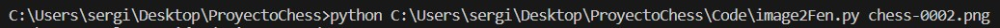
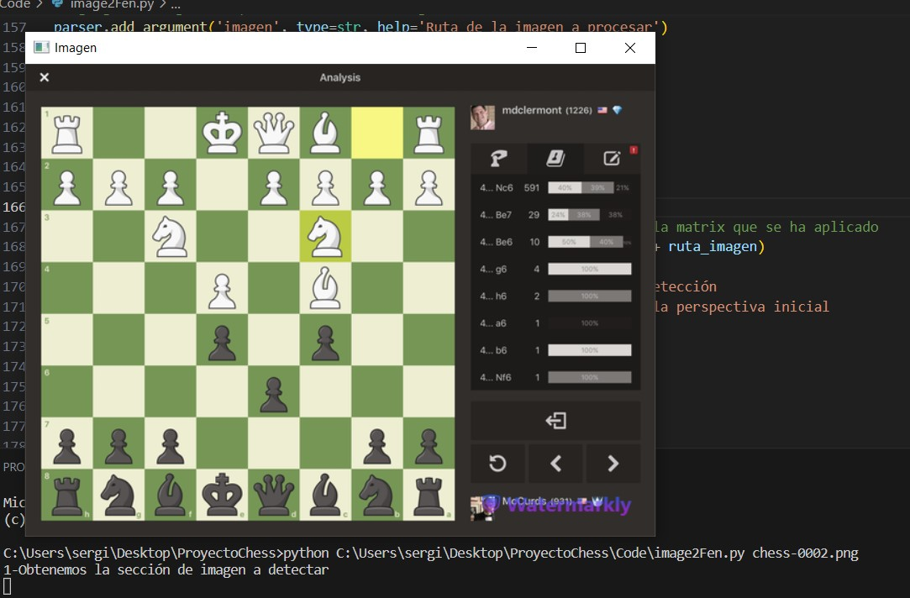
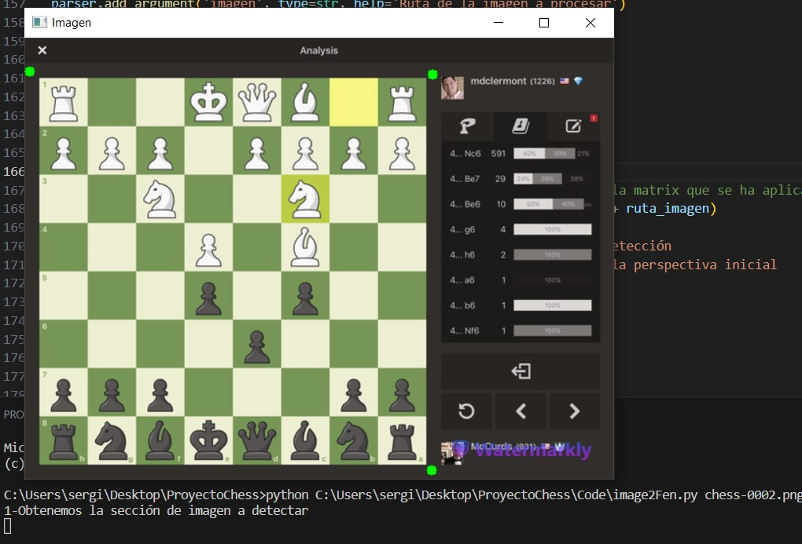
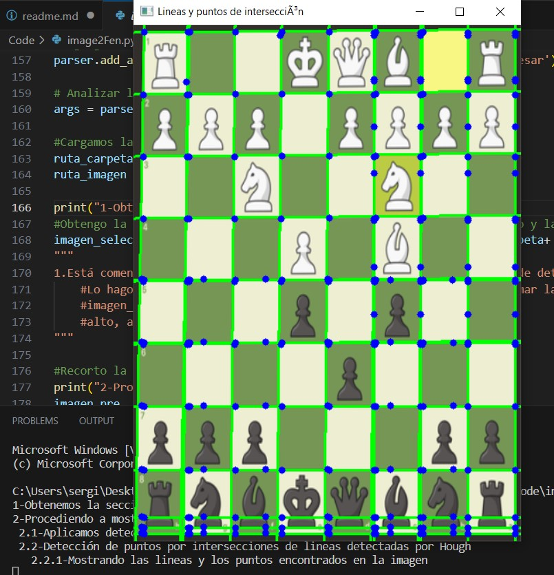
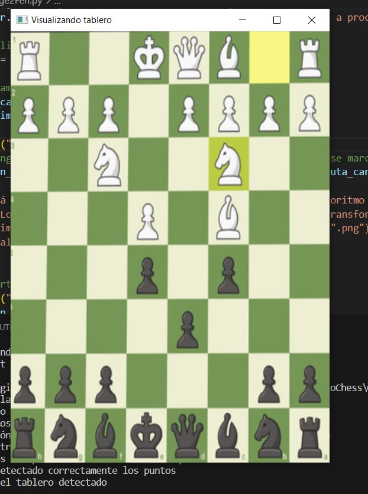
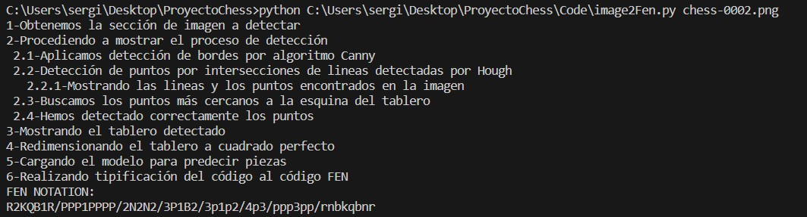
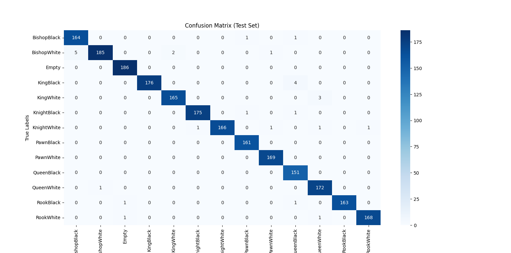
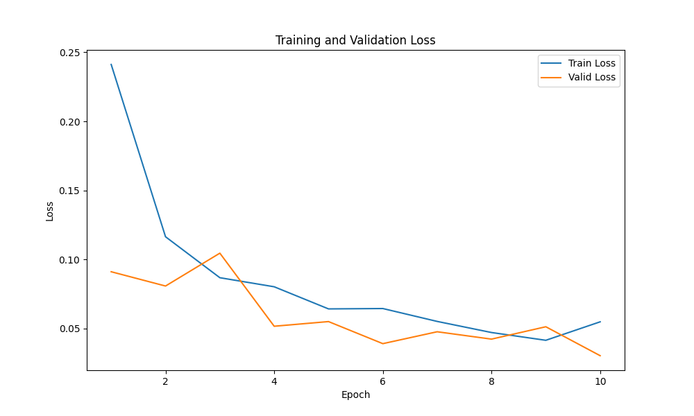
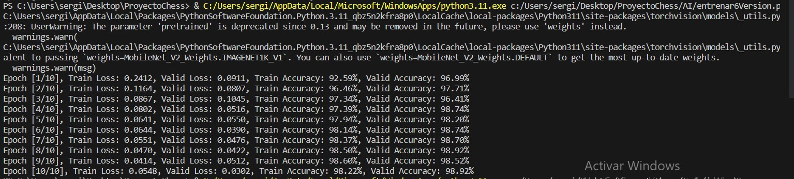

## Installation

To run this project, you'll need to set up the required dependencies. Follow these steps:

1. Clone the repository:https://github.com/serg6io4/ChessProject

2. Create a virtual environment (optional but recommended):

```env
virtualenv venv
source venv/bin/activate
```

3. Install project dependencies:

```setup
pip install -r requirements.txt
```

4. Run the project(after introduce your image in the dataset):
>📋It is important that you stay in the main folder of this project with your command prompt, this is an example:
```important
C:Users\...\ProyectoChess>python "path_to_file\image2Fen.py" "name_image"
```
>📋Another thing that is important: introduce your image in the dataset to use the program with the image

## Other ways of installation

>📋You can use download and execute setup.py, and this file will create the directories and the files in a especific path
```setup
python "path\setup.py" "path_save_directory\name_directory"
```
>📋This will create the same diretory with all dependencies and requeriments(but not in a virtual enviorement)

## Performance
>📋Now we are going to see a tutorial:
>📋First, you have to go to the command prompt(or the python console) and use the line of run project(with your own paths):



>📋Inmediatly, you will see the image that you want to obtain the ID:



>📋Now, you have to select the four points near to the chess table in the image:



>📋The program show the intersections and the point to find the corners:



>📋And you wil see the chess table cropped up:



>📋Finally in the command prompt, you will see the steps and in the last line, it shows the Fen notation of the chess table of the image:



>📋If it does not work for your image, the program will let you crop the image for corners of the chess table and you will have the Fen Notation in the same way.


## Training

To train the model(with your own data), you have to use the next command line:

```train
python "path_to_train.py" "path_to_data_directory" "path_to_save_directory"
```
>📋You have to run this command line. There are two arguments, the first is the directory of your main folder of data, and the second argument is the directory to save the model.


## Evaluation

To evaluate the model(with your own data), you have to use the next command line:

```eval
python "path_to_eval.py" "path_to_model_directory" "path_to_data_directory"
```
>📋This command line execute the evaluation of the classifier that was created with your own data, and show the confusion matrix.


## Results 

My chess classifier achieves the following performance:

| Model name                         | Training accuracy | Validation accuracy | Training loss| validation loss|
|------------------------------------|-------------------|---------------------|--------------|----------------|
| mobilenetv2_chess_classification   |        98,22%     |         98,92%      |     0,0548   |      0,0302    |

>📋Confusion Matrix


>📋Training and validation loss


>📋Accuracy
_4.png)

>📋Training results
